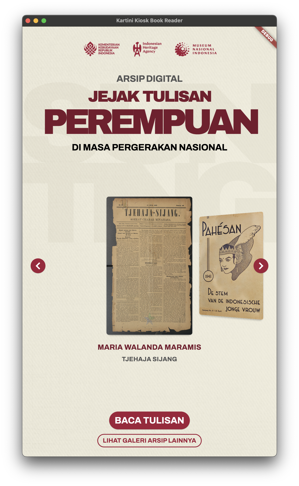
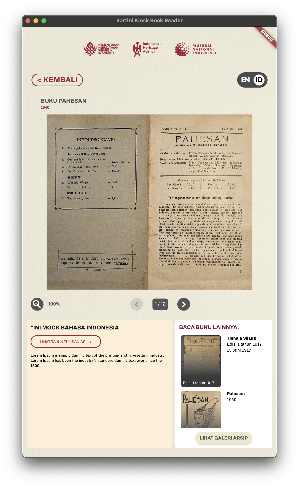
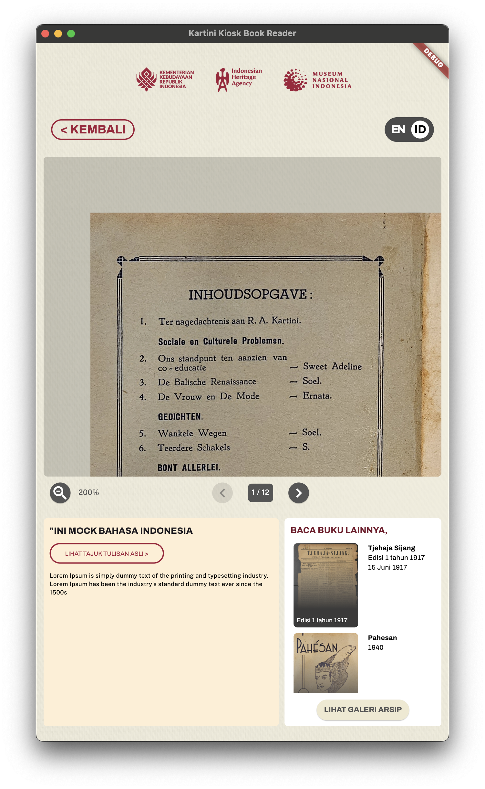
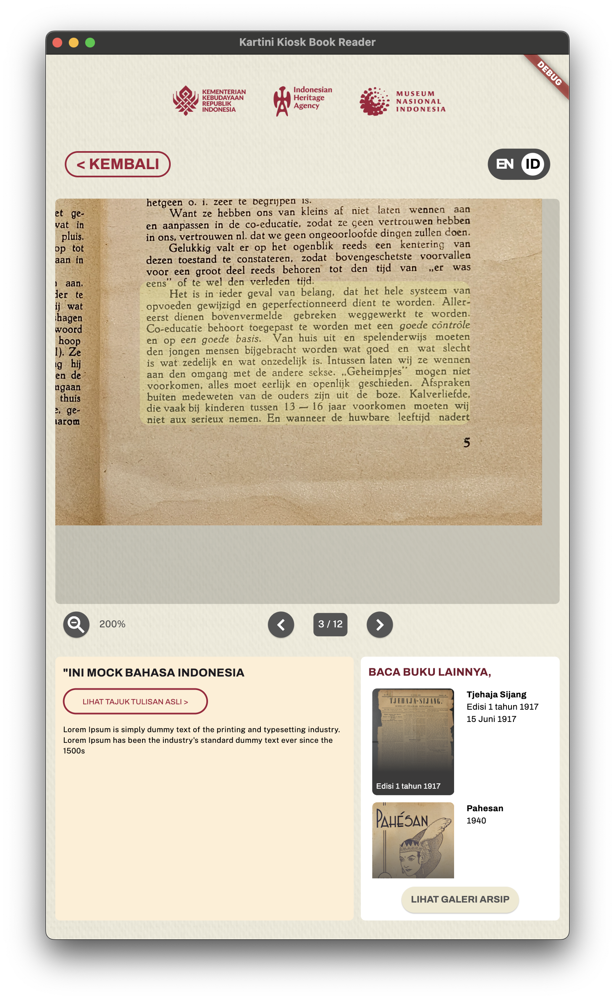
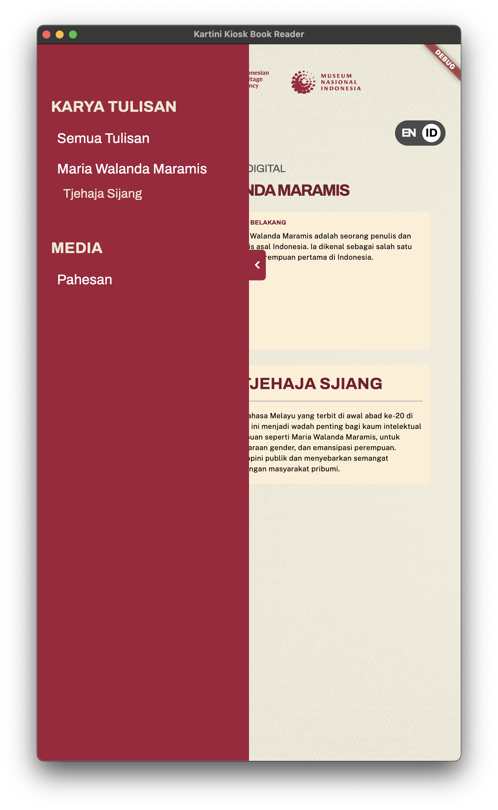

# Kartini Day 2025 – National Museum Kiosk App 🇮🇩

A Flutter-based interactive kiosk app developed for **Indonesia’s National Museum** in celebration of **Kartini Day 2025**. This app is designed to run on Windows devices in a kiosk setting, providing a seamless and engaging digital reading experience for visitors.

## 📚 Features

### 🗂️ Book List
- Display a curated collection of books relevant to Kartini Day and Indonesian heritage.
- Responsive layout suitable for touchscreen interaction.

### 🔍 Book Filter
- Easily find books based on categories or keywords.
- Quick search and filter interface optimized for kiosk users.

### 📖 Book Reader
- **Custom Flip Animation**: Enjoy a smooth and lifelike page-turning effect.
- **Zoom & Pan**: Visitors can zoom into text or images and pan around for better readability.
- **Highlighting**: Tap and highlight areas of interest—great for educational purposes or deeper reading engagement.

## 🛠 Tech Stack

- **Framework**: [Flutter](https://flutter.dev/) (optimized for Windows desktop)
- **Custom Animations**: Built using Flutter's animation and gesture detection APIs
- **Interactive UX**: Designed for large touchscreen displays in a museum kiosk environment

## ⚙️ CI/CD

This project uses **GitHub Actions** to automatically build `.exe` files for Windows on every commit, ensuring the latest version is always ready for deployment.

## 🖼 Screenshots

All datas are mocks

### 📚 Book List View


### 📖 Book Reader


### 🔎 Zoom Feature


### 📖 Highlight Feature


### 📖 Book Filter


## 🚀 Getting Started

To run the project:

```bash
flutter config --enable-windows-desktop
flutter pub get
flutter run -d windows
